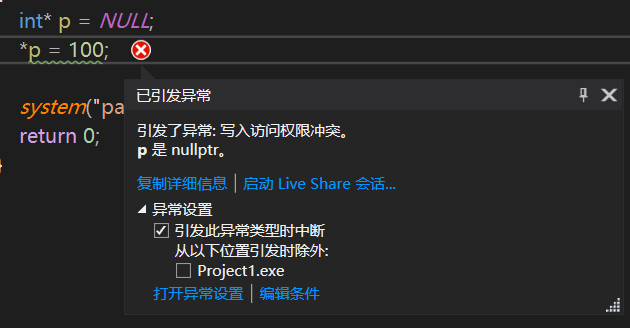
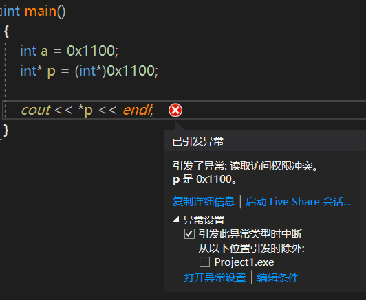

# cpplearning
[toc]

## 一、初始C++
- 需要Fn+F5才能调试
- ```system("pause");```用来暂停程序进程
- 变量作用：给一段指定的内存空间起名，方便操作这段内存
- 常量作用：用于记录程序中不可更改的数据  
定义方式：  
1. #defube'宏常量：```define 变量名 常量值``` 通常在文件上方定义，不占内存空间
2. #const修饰的变量：```const 数据类型 常量名 = 常量值``` 通常在变量定义前加关键字const，修饰该变量为常量，占内存空间
- 关键字作用：C++中预先保留的单词（标识符）。在定义变量或者常量的时候，不要使用关键字。
- 标识符命名规则：C++规定给标识符（变量、常量）命名时，有一套自己的规则
    - 标识符不能是关键字
    - 标识符只能用字母、数字、下划线组合
    - 第一个字符必须是字母或下划线
    - 标识符中字母区分大小写

&nbsp;
## 二、数据类型
C++规定在创建一个变量或者常量时，必须要指定出相应的数据类型，否则无法给其分配内存
- **整形**  
C++中能够表示整形的类型有以下几种方式，区别在于所占内存空间不同： 
 
| 数据类型 | 占用空间 | 取值范围 |
| :----: | :----: | :----: |
| short(短整型) | 2字节 | $-2^{15}$ ~ $2^{15}-1$ |
| int(整型) | 4字节 | $-2^{31}$ ~ $2^{31}-1$ |
| long(长整型) | Windows为4字节，32位Linux为4字节，64位Linux位8字节 | $-2^{31}$ ~ $2^{31}-1$ |
| long long(长长整型) | 8字节 | $-2^{63}$ ~ $2^{63}-1$ |
>计算机使用二进制计数来记录信息，1字节=8字(1B=8bit)。比如int类型，4个字节占32个字，第一位用来表示符号位，其余的31位用来表示数值。因为0既不是正数也不是负数，它占用了0000（十六进制0）的位置，因此正数个数比负数少一个，才多了-1。  

**取值越界**就好比十进制运算，给计算机分配了一个字，现在1+9需要进位，但因为只有一个字，所以1+9=0。ex:
```cpp
short num = 32768;
cout << num << endl; // 输出的是-32768
```
计算机二进制运算中，负数由补码形式表示。正数的原码、反码、补码都是本身，负数的补码是反码+1。  
[+1] = [00000001]<sub>原</sub> = [00000001]<sub>反</sub> = [00000001]<sub>补</sub>  
[-1] = [10000001]<sub>原</sub> = [11111110]<sub>反</sub> = [11111111]<sub>补</sub>  
最小的负整数 -32768，计算机中二进制标示：10000000   00000000  
最小负整数-32768加1之后，在计算机中的表示就是：10000000 00000001，对应的值就是- $ (2^{15} $ -1),即-32767。然后一直加1，直到11111111 11111111，对应的值就是-1，再加1，就变成了1 00000000 00000000，即17位，而short类型只读取16位，所以-1+1=0。00000000 00000000一直加1，加到01111111 11111111，就变成了short类型的最大整数32767。再加1，就变成了10000000 00000000，即最小负数：-32768。
>小结：正数最大值加1后产生越界，第一位符号位由原来符号类型转变为另一类型，此时若正数转换为负数，负数数值将以补码形式表示。  
- **sizeof**关键字作用：统计数据类型所占内存大小
```cpp
int num = 1;
cout << sizeof(num) << endl; // 4字节
cout << sizeof(long) << endl; // 4字节
```
&nbsp;
- **实型**（浮点型）作用：用于表示小数  
浮点型变量分为两种：
    1. 单精度float
    2. 双精度double
两者的区别在于表示的有效数字范围不同。有效数字包括整数和小数部分。

| 数据类型 | 占用空间 | 有效数字范围 |
| :----: | :----: | :----: |
| float | 4字节 | 7位有效数字 |
| double | 8字节 | 15~16位有效数 |

为什么float是7位呢？因为4字节=32位。1位符号位，8位指数位，23位尾数位。$2^{23}$=8388608，一共七位。符号位0表示正数，1表示负数。符号位之后的指数位，决定了数字的范围。指数位之后的尾数位，决定了数字的精度（即保留几位数或有效数字）

| 数据类型 | 符号位 | 指数位 | 尾数位 |
| :----: | :----: | :----: | :----: |
| float | 第31位（占1bit） | 第30-23位（占8bit） | 第22-0位（占23bit） |
| double | 第63位（占1bit） | 第62-52位（占11bit） | 第51-0位（占52bit） |

以double为例，双精度浮点型的数转化为二进制的数保存，读取时根据指数位和尾数位的值转化成双精度浮点数。  
比如说存储8.8125这个数，它的整数部分的二进制是1000，小数部分的二进制是1101.这两部分连起来是1000.1101，但是存储到内存中小数点会消失，因为计算机只能存储0和1。  
1000.1101这个二进制数用科学计数法表示是1.0001101 * $2^{3}$，这里的3（0011）即为指数  
现在符号位是0，尾数位就是科学计数法小数部分的0001101。指数位用来存储科学计数法的指数，此处为3。指数位有正负，11位指数位表示的指数范围是-1023 ~ 1024  
可以判断数值的最大值位53位二进制的最大值：$2^{53}$ - 1  
ps: 科学计数法中小数点前的1可以省略，因为这一位永远是1。0.5的二进制科学计数为1.00 * $2^{-1}$  

&nbsp;
两个浮点数相加可能会产生误差。比如比如 0.1 + 0.2 的结果是 0.30000000000000004  
这是因为 0.1 和 0.2 用二进制表示时为 0.0001 1001 1001 1001…(1100循环) 和 0.0011 0011 0011 0011…(0011循环)。如果截取于第 52 位，就会得到一个有误差的结果。ex：
```cpp
int main()
{
	//默认情况下，输出一个小数，会显示6位有效数字
	float f1 = 3.1415926f; //不加f默认是double类型。删掉f，鼠标放在3.14可以查看类型
	double d1 = 3.1415926;

	cout << "f1=" << f1 << endl;
	cout << "d1=" << d1 << endl;

	//统计float和double占用内存空间
	cout << "float所占内存空间为:" << sizeof(f1) << "字节" << endl;
	cout << "double所占内存空间为:" << sizeof(d1) << "字节" << endl;

	//科学计数法
	float f2 = 3e2;		//3*10^2
	float f3 = 3e-2;	//3*10^-2

	cout << "f2=" << f2 << endl;
	cout << "f3=" << f3 << endl;
	system("pause");
	return 0;
}
```
```cpp
// 输出
f1=3.14159
d1=3.14159
float所占内存空间为:4字节
double所占内存空间为:8字节
f2=300
f3=0.03
```
>小结：float变量不加f默认是double类型。

- **字符型**：在显示字符型变量时，用单引号将字符括起来，不要用双引号。单引号内只能有一个字符，不可以是字符串。
    - C和C++中字符型变量只占用一个字符
    - 字符型变量并不是把字符本身放到内存中存储，而是将对应的ASCII码放在存储单元中
        - ASCII非打印控制字符：ASCII表上的数字0-31分配给了控制字符，用于控制像打印机等外围设备
        - ASCII打印控制字符：数字32-126分配给了能在键盘上找到的字符，当查看或打印文档时就会出现

- **转义字符**作用：用于表示一些不能显示出来的ASCII字符
```cpp
int main()
{
	//反斜杠 错误，cout << "\" << endl;
	cout << "\\" << endl;
	
	//水平制表符	\t占八个字符，包括\t之前的字符个数	优点是数据输出整齐
	cout << "123\tHelloWorld" << endl;
	cout << "12345\tHelloWorld" << endl;

	//换行符 两个效果相同
	cout << "Hello\n" ;
	cout << "Hello" << endl;

	system("pause");
	return 0;
}

```
```cpp
// 输出
\
123    HelloWorld
12345   HelloWorld
Hello
Hello
```

- **字符串型**作用：用于表示一串字符  
两种风格： 
    1. C语言风格字符串：char 变量名[] = "字符串值"；
    2. C++风格字符串：string 变量名 = "字符串值";
```cpp
// 1.C语言风格字符串 char 字符串名[] = "xx"
//注意:等号后面要用双引号 包含起来字符串
char str[] = "Hello World";

// 2.C++风格字符串 用C++风格字符串时，要包含“#include <string>”头文件（但std命名空间包含std::string）
string str2 = "Hello World";
```

- **布尔类型**作用：代表真或假的值，占1字节，编译器中输出true的值为1，false为0
- **数据的输入**作用：用于从键盘获取数据。关键字：```cin``` 语法：```cin >> 变量```

&nbsp;
## 三、运算符
**作用**：用于执行代码的运算  
主要分为以下四类：算术运算符、赋值运算符、比较运算符、逻辑运算符  
1. 算术运算符：四则运算  
	- 除法运算中除数不能为0，两个整数相除小数部分被去除
	- 取模运算除数不能为0，且小数不能做取模运算
	- 前置递增先让变量+1然后进行表达式运算，后置递增先让表达式运算再让变量+1
2. 赋值运算符：用于将表达式的值赋值给变量
3. 比较运算符：用于表达式的比较，并返回一个真值或假值 ex：4<3输出0
4. 逻辑运算符：用于根据表达式的值返回真值或假值  
逻辑非！，逻辑与&&，逻辑或||，在C++中除了0都为真

&nbsp;
## 四、程序流程结构
C/C++支持最基本的三种程序运行结构：
- **顺序结构**：程序按顺序执行，不发生跳转
- **选择结构**：依据条件是否满足，有选择地执行相应功能
- **循环结构**：依据条件是否满足，循环多次执行某段代码

### 选择结构 
- **if语句**：执行满足条件的语句
	- 单行各式if语句(if条件后不加分号)：if (条件) {条件满足执行的语句}
	- 多行if语句：if (条件) {条件满足执行的语句} else {条件不满足执行的语句}
	- 多条件if语句(或if嵌套if语句)：if (条件1) {条件1满足执行的语句} else if(条件2) {条件2满足执行的语句}...else {都不满足执行的语句}  
	ex：
	```cpp
	#include <iostream>
	using namespace std;

	// 判断三个人体重
	int main()
	{
		int w1, w2, w3;

		cout << "A weight:" << endl;
		cin >> w1;
		cout << "B weight:" << endl;
		cin >> w2;
		cout << "C weight:" << endl;
		cin >> w3;

		if (w1 > w2) {
			if (w1 > w3)
				cout << "A最重" << endl;
			else
				cout << "C最重" << endl;
		}
		else
		{
			if (w2 > w3)
				cout << "B最重" << endl;
			else
				cout << "C最重" << endl;
		}
		
		system("pause");
		return 0;
	}
	```

- **三目运算符**：通过三目运算符实现简单的判断  
语法：表达式1 ？表达式2 ：表达式3
```cpp
c = (a > b ? a : b);
(a > b ? a : b) = 100; // C++中的三目运算符返回的是变量，可以继续赋值
```
- **switch语句**：执行多条件分支语句（注意break的使用）
```cpp
#include <iostream>
using namespace std;

int main()
{
	//1.提示用户给电影评分
	cout << "请给电影打分" << endl;

	//2.用户开始进行打分
	int score;
	cin >> score;
	cout << "您打的分数为:" << score << endl;

	//3.根据用户输入的分数来提示用户最后的结果
	switch (score)
	{
	case(10):
	case(9):
		cout << "您认为是经典电影" << endl;
	case(8):
	case(7):
		cout << "您认为电影非常好" << endl;
	case(6):
	case(5):
		cout << "您认为电影一般" << endl;
		break;
	default:
		cout << "您认为电影是烂片" << endl;
		break;
	}

	system("pause");
	return 0;
}
```
输出
```
请给电影打分
10
您打的分数为:10
您认为是经典电影
您认为电影非常好
您认为电影一般
请按任意键继续. . .
```
>小结：  
switch缺点：判断时候只能是整型或者字符型，不可以是一个区间  
switch优点：结构清晰，执行效率高  
注意break：case里如果没有break那么程序会一直执行，执行break则会跳出switch

### 循环结构
- **while循环语句**  
作用：满足循环条件，执行循环语句  
语法：while (循环条件) {循环语句}  
解释：只要满足循环条件结果为真，就执行循环语句  
注意：在执行循环语句的时候，程序必须提供跳出循环的出口，否则出现死循环  
ex：猜数字  
```cpp
#include <iostream>
using namespace std;

int main()
{
	// 添加随机数种子配合rand，利用当前系统时间生成随机数，防止每次随机数都一样
	srand((unsigned int)time(NULL));

	// 1. 系统生成随机数
	int num = rand() % 100 + 1; // 生成100个随机数，区间为0+1~99+1
	
	int guess;
	cout << "游戏开始，猜数吧" << endl;

	while (1)
	{
		cin >> guess;
		if (guess > num)
			cout << "猜大了" << endl;
		else if (guess < num)
			cout << "猜小了" << endl;
		else
		{
			cout << "猜对了" << endl;
			break; // while(1)需要用break来退出循环
		}
	}

	system("pause");
	return 0;
}
```
- **do...while循环语句**  
作用：满足循环条件，执行循环语句  
语法：do{循环语句} while{循环条件}  
注意：与while的区别在于do...while会执行一次循环语句，再判断循环条件
```cpp
int main()
{
	//1.先打印所有三维数字
	int num = 100;
	int a, b, c;	//代表个位、十位、百位
	do
	{,. 
        //2.从所有三位数字中找到水仙花数
		a = num % 10;		//获取数字的个位
		b = num / 10 % 10;	//获取数字的十位
		c = num / 100;		//获取数字的百位
		if (a*a*a + b * b*b + c * c*c == num)	//如果是水仙花数才打印
			cout << num << " ";
		num++;
	} while (num < 1000);

	system("pause");
	return 0;
}
```
- **for循环语句**  
作用：满足循环条件，执行循环语句  
语法：for {起始表达式；条件表达式；末尾循环体} {循环语句；}  
ex：拆分for
```cpp
int main()
{
    //for循环
    //从数字0 打印到 数字9
    int i = 0;
    for ( ; ; )
    {
        if(i>=10)
            break;
        cout << i << endl;
        i++;
    }

    system("pause");
    return 0;
}
```
- **循环嵌套**  
作用：在循环体中再嵌套一层循环，解决一些实际问题  
例如我们打印一个10x10的矩阵  
```cpp
for (int i = 0; i < 10; i++)
{
	for (int j = 0; j < 10; j++)
	{
		cout << "* ";
	}
	cout << '\n';
}
```
ex：九九乘法表
```cpp
for (int i = 1; i < 10; i++)
{
	for (int j = 1; j <= i; j++)
	{
		cout << j << '*' << i << '*' << j * i<< '\t';
	}
	cout << '\n';
}
```

### 跳转语句
- **break语句**  
作用：用于跳出选择结构或者循环结构  
使用时机：  
	- 出现在switch条件语句中，作用是终止case并跳出switch
	- 出现在循环语句中，作用是跳出当前循环语句
	- 出现在嵌套循环中，跳出最近的内层循环语句

ex：
```cpp
#include <iostream>
using namespace std;

int main()
{
	cout << "请选择副本难度" << endl;
	cout << "1.简单" << "\t" << "2.普通" << "\t" << "3.困难" << endl;

	int select;
	cin >> select;
	switch (select)
	{
	case 1:
		cout << "进入简单模式" << endl;
		break;
	case 2:
		cout << "进入普通模式" << endl;
		break;
	default:
		cout << "进入困难模式" << endl;
		break;
	}

	system("pause");
	return 0;
}
```
- **continue语句**  
作用：在循环语句中，跳过本次循环中余下尚未执行的语句，继续执行下一次循环  
```cpp
int main()
{
	//continue语句
	for (int i = 0; i <= 100; i++) // 注意这里只有一层循环，所以break会直接退出
	{
		//如果是奇数输出，偶数不输出
		if (i % 2 == 0) 
		{
			continue;	//可以筛选条件，执行到此就不再向下执行，执行下一次循环
			//break会退出循环，而continue不会
		}
		cout << i << " ";
	}

	system("pause");
	return 0;
}
```
- **goto语句**  
作用：可以无条件跳转语句  
语法：go to 标记  
解释：如果标记的名称存在，执行到goto语句时，会跳转到标记的位置  
```cpp
int main()
{
	cout << "1.xxx" << endl;
	goto Flag;
	cout << "2.xxx" << endl;
Flag:
	cout << "4.xxx" << endl;

	system("pause");
	return 0;
}
```
输出
```cpp
1.xxx
4.xxx
```
注意：在程序中不建议使用goto语句，以免造成程序混乱！

&nbsp;
## 五、数组
数组其实就是一个集合，里面存放了相同类型的数据元素  
**特点1**：数组中的每个数据元素都是相同的数据类型  
**特点2**：数组是由连续的内存位置组成的  
- **一维数组**  
三种定义方式：
	1. 数组类型 数组名[数组长度]；
	2. 数组类型 数组名[数组长度] = {值1，值2...}；
	3. 数组类型 数组名[] = {值1，值2...}；
```cpp
int main()
{
	//数组命名规范与变量名命名规范一致，不要和变量重名 
	//1. 数组类型 数组名[ 数组长度 ];
	int arr[1];
	arr[0] = 50; // 数组中下标是从0开始索引
	//访问数组元素
	cout << arr[0] << endl;

	//2.数据类型 数组名[ 数组长度 ] = { 值1,值2... };
	//如果在初始化数据的时候，没有全部填写完，会用0来填补剩余数据
	int arr2[5] = { 10,20,30,40 };
	for (int i = 0; i < 5; i++)
	{
		cout << arr2[i] << " "; // 正常输出前四个值，最后一个为0
	}
	cout << endl;

	//3.数据类型 数组名[ ] = { 值1,值2... };
	//定义数组的时候，必须有初始长度，或对其至少赋一个值
	int arr3[] = { 10,20,30,40 };
	for (int i = 0; i < 5; i++)
	{
		cout << arr3[i] << " "; // 正常输出前四个值，最后一个为随机值
	}
}
```
- **一维数组组名**  
用途：  
1. 可以统计整个数组在内存中的长度  
2. 可以获取数组在内存中的首地址  
ex：
```cpp
int main()
{
	//数组名用途
	//1.可以通过数组名统计整个数组占用内存大小
	int arr[10] = { 1,2,3,4,5,6,7,8,9,10 };
	cout << "整个数组占用内存空间为:" << sizeof(arr) << endl;
	cout << "每个元素占用内存空间:" << sizeof(arr[0]) << endl;
	cout << "数组中元素的个数为:" << sizeof(arr) / sizeof(arr[0]) << endl; // 求数组中的元素个数方法，会经常用到

	//2.可以通过数组名查看数组首地址
	cout << "数组首地址(十六进制)" << arr << endl;
	cout << "数组首地址(十进制)" << (int)arr << endl;
	cout << "数组中第一个元素地址为:" << (int)&arr[0] << endl;
	cout << "数组中第二个元素地址为:" << (int)&arr[1] << endl;

	//数组名是常量，不可以进行赋值操作
	//arr=100;
}
```
输出
```cpp
整个数组占用内存空间为:40
每个元素占用内存空间:4
数组中元素的个数为:10
数组首地址(十六进制)0000003AF32FF5D8
数组首地址(十进制)-214960680
数组中第一个元素地址为:-214960680
数组中第二个元素地址为:-214960676
```
ex1：找出数组中最大值
```cpp
max = max > arr[i] ? max : arr[i]
```
ex2：数组元素拟制
```cpp
int tmp = arr[start];
arr[start] = arr[end]; // 结束下标可以用sizeof(arr) / sizeof(arr[0])-1获得
arr[end] = tmp;
start ++;
end --;
```
- **冒泡排序**  
依次比较相邻元素大小并交换，交换过后的最大值出现在数组末尾，每次比较次数-1求得最末位-1的最大值，直至首元素和第二个元素最后一次比较。
```cpp
int main()
{
	// 冒泡排序
	int arr[9] = { 3, 4, 5, 1, 2, 63, 23, 21, 0 };
	int n = sizeof(arr) / sizeof(arr[0]);

	for (int i = 0; i < n - 1; i++)
	{
		int tmp = 0;
		for (int j = 0; j < n - i - 1; j++)
		{
			if (arr[j] > arr[j + 1])
			{
				tmp = arr[j];
				arr[j] = arr[j + 1];
				arr[j + 1] = tmp;
			}
		}
	}

	for (int i = 0; i < n; i++)
	{
		cout << arr[i] << " ";
	}

	system("pause");
	return 0;
}
```

- **二维数组**  
在一维数组上多加了一个维度，四种定义方式：  
1. 数据类型 数组名[行数][列数]；
2. 数据类型 数组名[行数][列数] = {{数据1，数据2}，{数据3，数据4}}；（**最直观**）
3. 数据类型 数组名[行数][列数] = {数据1，数据2，数据3，数据4}；
4. 数据类型 数组名[][列数] = {数据1，数据2，数据3，数据4}；  
ex:
```cpp
int main()
{
	int arr[][3] = { 1, 2, 3, 4, 5, 6 };
	for (int i = 0; i < 2; i++)
	{
		for (int j = 0; j < 7; j++) // 超出原定行数或列数的位置，如果数组元素足够可以补全，否则会输出随机值
		{
			cout << arr[i][j] << " ";
		}
		cout << endl;
	}

	system("pause");
	return 0;
}
```
输出
```cpp
1 2 3 4 5 6 -858993460
4 5 6 -858993460 -858993460 -858993460 -858993460
```
- **二维数组组名**  
查看二维数组所占内存空间  
获取二维数组首地址  
```cpp
sizeof(arr) // 求二维数组占用的内存空间
sizeof(arr[0]) // 第一行占用的内存
sizeof(arr[0][0]) // 第一个元素占用的内存
sizeof(arr) / sizeof(arr[0]) // 行数
sizeof(arr[0]) / sizeof(arr[0][0]) // 列数
```

&nbsp;
## 六、函数
- **作用**：将一段经常使用的代码封装起来，减少重复代码  
一个较大的程序，一般分为若干个程序块，每个模块实现特点的功能  
- **定义**：
1. 返回值类型：在函数定义中一个函数可以返回一个值；如果不需要返回值则用void
2. 函数名：给函数起的名称
3. 参数列表：使用该函数时传入的数据
4. 函数体语句：花括号内的代码，函数内需要执行的语句
5. return表达式：和返回值类型挂钩，函数执行完后返回相应的数据；返回值不需要的话可以不写return
- **语法**：
```cpp
返回值类型 函数名 (参数列表)
{
	函数体语句

	return 表达式;
}
```
- **调用**：使用定义好的函数  
语法：函数名（参数）  
函数定义里小括号内成为形参，函数调用时传入的参数成为实参
- **值传递**：函数调用时实参将数值传入形参的过程，形参改变不会影响实参
- **函数的声明**：  
>如果把函数写在main函数之后，因为程序是按顺序执行的，所以找不到函数定义。可以用函数声明来解决  

作用：告诉编译器函数名称及如何调用函数。函数的实际主体可以单独定义  
函数的**声明可以多次**，但是函数的**定义只能有一次**

ex：
```cpp
// 声明
int max(int a, int b);

int main()
{
	int a = 10;
	int b = 20;

	cout << max(a, b) << endl;
	return 0;
}

// 定义
int max(int a, int b)
{
	return a > b ? a : b;
}
```
- **函数的分文件编写**  
作用：让代码结构更清晰  
四个步骤：
1. 创建后缀名为.h的头文件
2. 创建后缀名为.cpp的源文件
3. 在头文件中写函数的声明
4. 在源文件中写函数的定义  
ex：  
新建swap.h头文件
```cpp
#include <iostream>
using namespace std;

// 函数声明
void swap(int a, int b);
```
新建swap.cpp源文件
```cpp
#include "swap.h"

void swap(int a, int b)
{
	int tmp = a;
	a = b;
	b = tmp;

	cout << "a =" << a << " b =" << b << endl;
}
```
新建函数的分文件编写.cpp
```cpp
#include "swap.h"

int main()
{
	int a = 10;
	int b = 20;
	swap(a, b);

	system("pause");
	return 0;
}
```
>小结：  
在头文件"swap.h"，注意添加#include \<iostream>, using namespace std;  
在源文件"swap.cpp"，注意添加#include "swap.h"，将"swap.cpp"和"swap.h"关联

&nbsp;
## 七、指针
- **基本概念**  
作用：可以通过指针间接访问内存  
	- 内存编号是从0开始记录的，一般用十六进制数字表示
	- 可以利用指针变量保存地址
- **定义和使用**  
指针变量定义语法：数据类型 * 变量名
```cpp
int a = 10;
int * p; // 定义指针
p = &a; // 记录变量a的地址

*p = 100; // 使用指针，通过解引用的方式来找到指针指向的内存中的数据
```
- **指针所占内存空间**  
在32位操作系统下，指针占4个字节空间大小  
在64位操作系统下，指针占8个字节空间大小  
```cpp
sizeof(int *) // 输出8(x64) 输出4(x86)
sizeof(char *) // 输出8(x64) 输出4(x86)
```
- **空指针和野指针**  
空指针：指针变量指向内存中编号为0的空间  
用途：初始化指针变量  
注意：空指针指向的内存是不可以访问到  
```cpp
// 1.空指针用于给指针变量进行初始化
int *p = NULL;

// 2.空指针是不可以访问的
// 0-255之间的内存编号是系统占用的，因此不可以访问
*p = 100;
```
>输出：  


- **野指针**  
```cpp
// 指向内存被释放的内存或者没有访问权限的内存的指针
int *p = (int *)0x1100;
```
>输出：  


>小结：空指针和野指针都不是我们申请的空间，因此不要访问

- **const修饰指针**  
三种情况：
1. const修饰指针——常量指针
2. const修饰常量——指针常量
3. const既修饰指针，又修饰常量  
ex：
```cpp
// 1.常量指针
// 指针指向的值不可以改，指针的指向可以改
int a = 10;
int b = 10;

const int* p = &a;
*p = 20; // 错误
p = &b; // 正确

// 2.指针常量
// 指针的指向不可以改，指针指向的值可以改
int *const p2 = &a;
*p2 = 20; // 正确
p2 = &b; //错误

// 3.const同时修饰
// 都不可以改
const int * const p3;
```

- **指针和数组**  
作用：利用指针访问数组元素  
数组本身就是一个“指针”，记录内存空间地址
```cpp
int arr[5] = {1, 2, 3, 4, 5};
cout << arr[0]; // 1

int *p = arr;
cout << *p; // 1
p ++;
cout << *p; // 2
```

- **指针和函数**  
作用：利用指针作为函数参数，可以修改实参的值  
如果不想修改实参，就用值传递，如果想修改实参，就用地址传递
```cpp
#include <iostream>
using namespace std;

void swap(int *a, int *b)
{
	int tmp = *a;
	*a = *b;
	*b = tmp;
}

int main()
{
	int a = 10;
	int b = 20;

	swap(a, b); // or swap(&a, &b)
	cout << "a =" << a << " b =" << b << endl;
	return 0;
}
```

- **指针、数组、函数**  
对数组的冒泡排序
```cpp
#include <iostream>
using namespace std;

void bubble(int* arr, int len)
{
	for (int i = 0; i < len - 1; i++)
	{
		for (int j = 0; j < len - i - 1; j++)
		{
			if (arr[j] > arr[j + 1])
			{
				int tmp = arr[j];
				arr[j] = arr[j + 1];
				arr[j + 1] = tmp;
			}
		}
	}
}

void printArray(int *array, int len) // 因为数组本身就是一个"指针"，如果形参不带*调用时会报错 or 写成int array[]
{
	for (int i = 0; i < len; i++)
	{
		cout << array[i] << " ";
	}
}

int main()
{
	int arr[10] = { 4, 3, 2, 5, 1, 2, 6, 8, 9, 8 };
	int len = sizeof(arr) / sizeof(arr[0]);
	
	bubble(arr, len);
	printArray(arr, len); 

	return 0;
}
```

&nbsp;
## 八、结构体
结构体属于用户**自定义的数据类型**，允许用户存储不同的数据类型  
- **定义和使用**  
语法：struct 结构体名 {结构体成员列表}  
通过结构体创建变量的方式有三种：
	- struct 结构体名 变量名
	- struct 结构体名 变量名 = {成员1值，成员2值...}
	- 定义结构体时顺便创建变量 
```cpp
struct Student
{
	string name;
	int age;
	int score;
}s3; // 顺便创建的结构体变量

int main()
{
	// struct关键字可以省略
	// 第一种
	Student s1;
	s1.name = "李四";
	cout << s1.name << endl;

	// 第二种
	struct Student s2 = { "张三", 12, 33 };
	cout << s2.score << endl;

	// 第三种
	s3.age = 23;
	cout << s3.age << endl; 

	return 0;
}
```
>小结：  
定义结构体时的关键字是```struct```，不可以省略  
创建结构体变量时，关键字```struct```可以省略  
结构体变量利用操作符```.```访问成员

- **结构体数组**  
作用：将自定义的结构体放入到数组中方便维护  
语法：```struct 结构体名 数组名[元素个数] = {{}, {}, ..., {}}```
```cpp
struct Student
{
	string name;
	int age;
	int score;
}s3;

int main()
{
	Student s1[3] =
	{
		{ "张三", 12, 33 },
		{ "张2", 12, 33 },
		{ "张1", 12, 33 }
	};

	s1[2].name = "赵云";
	for (int i = 0; i < 3; i++)
	{
		cout << s1[i].name << " " << s1[i].age << " " << s1[i].score << endl;
	}

	return 0;
}
```

- **结构体指针**  
作用：通过指针访问结构体中的成员  
利用操作符```->```可以通过结构体指针访问结构体属性  
ex：
```cpp
Student s1 = { "张三", 12, 33 };
Student* p = &s1;
cout << p->name << endl;

// or
Student s1[3] =
{
	{ "张三", 12, 33 },
	{ "张2", 12, 33 },
	{ "张1", 12, 33 }
};

Student* p = s1; // 因为定义的是结构体数组，相当于指针，所以不需要取地址符
for (int i = 0; i < 3; i++)
{
	cout << p->name << endl;
	p++;
}
```

- **结构体嵌套结构体**  
作用：结构体中的成员可以是另一个结构体  
ex：老师包含学生
```cpp
struct student
{
	string name;
	int age;
	int score;
};

struct teacher
{
	string name;
	int age;
	int score;
	struct student stu;
};

int main()
{
	teacher t;
	t.stu.name = "小李";
}
```

- **结构体做函数参数**  
作用：将结构体作为参数向函数中传递  
两种方式：  
	- 值传递  
	- 地址传递

ex：
```cpp
struct Student
{
	string name;
	int age;
	int score;
}s3;

void printStudent1(Student s)
{
	s.age = 2;
}

void printStudent2(Student *s)
{
	s->age = 2;
}

int main()
{
	Student s = { "张三", 13, 33 };

	printStudent1(s);
	cout << s.age << endl; // 13
	printStudent2(&s);
	cout << s.age << endl; // 2

	return 0;
}
```

- **结构体中的const**  
作用：用```const```来防止误操作  
ex：
```cpp
// 将函数中的形参改为指针，可以减少内存空间，而且不会复制新的副本出来
void printStudent2(const Student *s)
{
	s->age = 2; // 因为形参中加入了const，此处修改会报错
}
```

- **结构体例题**  
1. 老师学生  
案例描述：三名老师，带五名学生。老师结构体存放老师姓名和学生数组，学生结构体存放姓名、考试分数。
```cpp
#include <iostream>
using namespace std;

struct student
{
	string sname;
	int score;
};

struct teacher
{
	string tname;
	student stuArray[5];
};

void allocateStudent(teacher tArray[], int len)
{
	// 分配名字
	string nameSeed = "ABCDE";
	
	for (int i = 0; i < len; i++)
	{
		tArray[i].tname = "Teacher_";
		tArray[i].tname += nameSeed[i];

		for (int j = 0; j < 5; j++)
		{
			tArray[i].stuArray[j].sname = "Student_";
			tArray[i].stuArray[j].sname += nameSeed[j];
			tArray[i].stuArray[j].score = rand() % 61 + 40;
		}
	}
}

void printInfo(teacher tArray[], int len)
{
	for (int i = 0; i < len; i++)
	{
		cout << "老师姓名：" << tArray[i].tname << endl;
		for (int j = 0; j < 5; j++)
		{
			cout << "学生姓名：" << tArray[i].stuArray[j].sname << " 考试分数：" << tArray[i].stuArray[j].score << endl;
		}
	}
}

int main()
{
	// 设置随机数种子
	srand((unsigned int)time(NULL)); // time函数必须传递参数，但参数类型与返回值无关所以传入空值无影响
	
	// 创建老师数组
	teacher tArray[3];

	int len = sizeof(tArray) / sizeof(tArray[0]);
	allocateStudent(tArray, len);

	printInfo(tArray, len);

	system("pause");
	return 0;
}
//
```
2. 英雄排序  
案例描述：给定一个五个英雄结构体，包括姓名、年龄、性别，按照年龄排序后输出
```cpp
#include <iostream>
using namespace std;

struct Hero
{
	string name;
	int age;
	string sex;
};

void bubbleSort(Hero herroArray[], int len)
{
	for (int i = 0; i < len - 1; i++)
	{
		for (int j = 0; j < len - i - 1; j++)
		{
			if (herroArray[j].age > herroArray[j + 1].age)
			{
				Hero tmp = herroArray[j];
				herroArray[j] = herroArray[j + 1];
				herroArray[j + 1] = tmp;
			}
		}
	}
}

void printInfo(Hero heroArray[], int len)
{
	for (int i = 0; i < len; i++)
	{
		cout << "姓名：" << heroArray[i].name << " 年龄：" << heroArray[i].age << " 性别：" << heroArray[i].sex << endl;
	}
}

int main()
{
	Hero heroArray[5] =
	{
		{"刘备",23,"男"},
		{"关羽",22,"男"},
		{"张飞",20,"男"},
		{"赵云",21,"男"},
		{"貂蝉",19,"女"}
	};
	
	int len = sizeof(heroArray) / sizeof(heroArray[0]);

	// 排序前
	printInfo(heroArray, len);
	// 冒泡排序
	bubbleSort(heroArray, len);
	// 排序后
	cout << "排序后:" << endl;
	printInfo(heroArray, len);

	system("pause");
	return 0;
}
```
